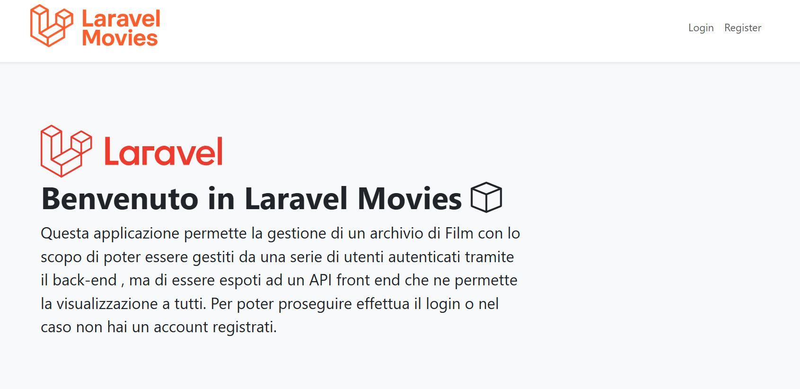
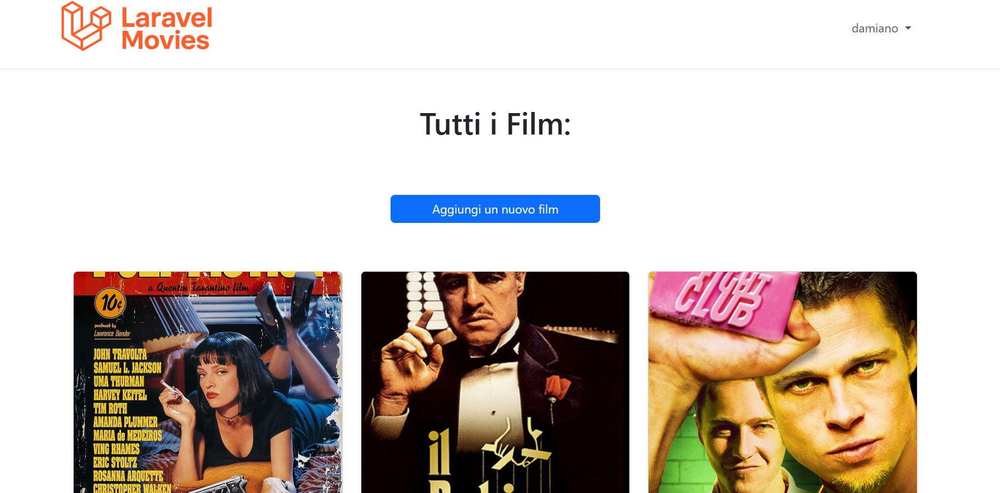
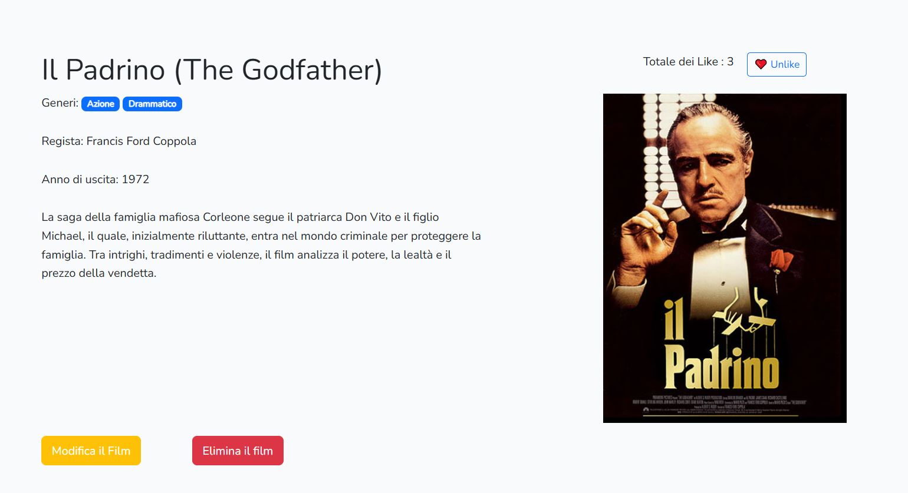
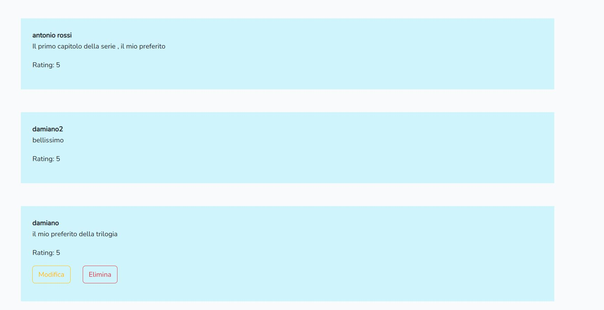
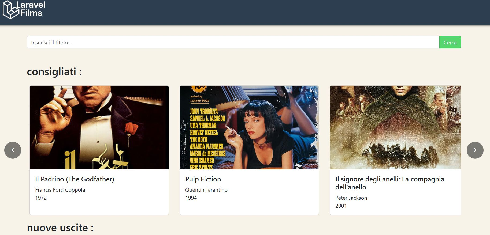
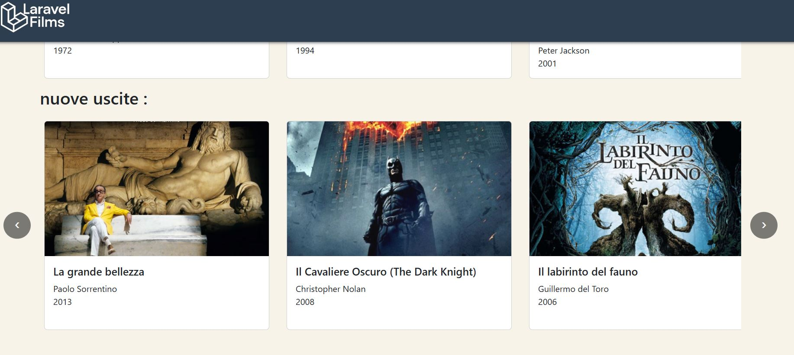
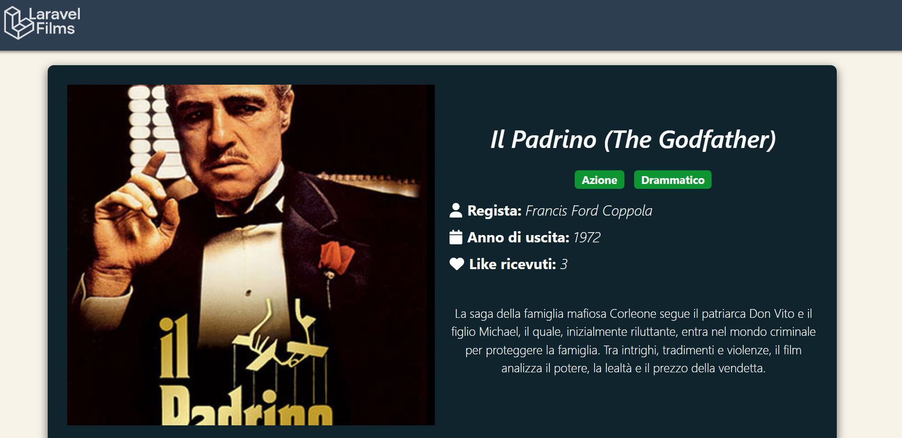
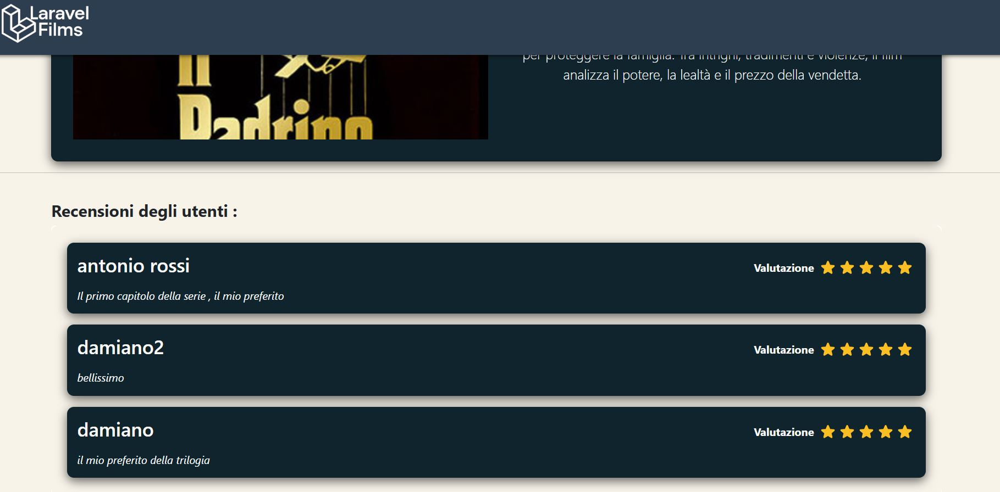

<!-- 

## About Laravel

Laravel is a web application framework with expressive, elegant syntax. We believe development must be an enjoyable and creative experience to be truly fulfilling. Laravel takes the pain out of development by easing common tasks used in many web projects, such as:

- [Simple, fast routing engine](https://laravel.com/docs/routing).
- [Powerful dependency injection container](https://laravel.com/docs/container).
- Multiple back-ends for [session](https://laravel.com/docs/session) and [cache](https://laravel.com/docs/cache) storage.
- Expressive, intuitive [database ORM](https://laravel.com/docs/eloquent).
- Database agnostic [schema migrations](https://laravel.com/docs/migrations).
- [Robust background job processing](https://laravel.com/docs/queues).
- [Real-time event broadcasting](https://laravel.com/docs/broadcasting).

Laravel is accessible, powerful, and provides tools required for large, robust applications.

## Learning Laravel

Laravel has the most extensive and thorough [documentation](https://laravel.com/docs) and video tutorial library of all modern web application frameworks, making it a breeze to get started with the framework.

You may also try the [Laravel Bootcamp](https://bootcamp.laravel.com), where you will be guided through building a modern Laravel application from scratch.

If you don't feel like reading, [Laracasts](https://laracasts.com) can help. Laracasts contains thousands of video tutorials on a range of topics including Laravel, modern PHP, unit testing, and JavaScript. Boost your skills by digging into our comprehensive video library.

## Laravel Sponsors

We would like to extend our thanks to the following sponsors for funding Laravel development. If you are interested in becoming a sponsor, please visit the [Laravel Partners program](https://partners.laravel.com).

### Premium Partners

- **[Vehikl](https://vehikl.com/)**
- **[Tighten Co.](https://tighten.co)**
- **[WebReinvent](https://webreinvent.com/)**
- **[Kirschbaum Development Group](https://kirschbaumdevelopment.com)**
- **[64 Robots](https://64robots.com)**
- **[Curotec](https://www.curotec.com/services/technologies/laravel/)**
- **[Cyber-Duck](https://cyber-duck.co.uk)**
- **[DevSquad](https://devsquad.com/hire-laravel-developers)**
- **[Jump24](https://jump24.co.uk)**
- **[Redberry](https://redberry.international/laravel/)**
- **[Active Logic](https://activelogic.com)**
- **[byte5](https://byte5.de)**
- **[OP.GG](https://op.gg)**

## Contributing

Thank you for considering contributing to the Laravel framework! The contribution guide can be found in the [Laravel documentation](https://laravel.com/docs/contributions).

## Code of Conduct

In order to ensure that the Laravel community is welcoming to all, please review and abide by the [Code of Conduct](https://laravel.com/docs/contributions#code-of-conduct).

## Security Vulnerabilities

If you discover a security vulnerability within Laravel, please send an e-mail to Taylor Otwell via [taylor@laravel.com](mailto:taylor@laravel.com). All security vulnerabilities will be promptly addressed.

## License

The Laravel framework is open-sourced software licensed under the [MIT license](https://opensource.org/licenses/MIT). -->

# 🎬 Progetto Laravel + React

## 📖 Consegna
L’obiettivo di questo progetto è realizzare un’applicazione completa composta da:
- Un **backoffice in Laravel** con autenticazione tramite Laravel Breeze, per la gestione CRUD di un’entità scelta (es. Film, Videogiochi, Album, ecc.) con almeno una relazione con un’altra entità.
- Un **frontend in React** accessibile agli utenti guest, che permette di:
  - Visualizzare la lista degli elementi
  - Consultare i dettagli di un singolo elemento
  - Mostrare le informazioni collegate tramite relazione (es. generi, categorie, console)

Il backend espone un set di **API REST**, consumate dal frontend tramite chiamate AJAX.

---

## 🛠️ Scelte progettuali
Per lo sviluppo del progetto ho scelto di lavorare sull’entità **Movies** 🎬, con la seguente struttura:
- **Movies** → contiene titolo, descrizione,regista, immagine di copertina, anno di uscita  
- **Genres** → relazione *many-to-many* con i film (un film può avere più generi, un genere può appartenere a più film)
- **Reviews** → relazione *one-to-many* con i film (un film può avere più recensioni, una recensione può appartenere ad un film) → relazione *one-to-many* con i gli users(un user può avere più recensioni, una recensione può appartenere ad un solo user)
- **Likes** → relazione *many-to-many* con i tra movies e users (tabella pivot)

### Motivazioni
- L’entità *Movies* è semplice ma realistica, perfetta per mostrare CRUD e relazioni.  
- La relazione *Film ↔ Generi* permette di gestire tag multipli e di avere un frontend più interessante.  
- L’uso di **Laravel Breeze** ha semplificato l’implementazione dell’autenticazione e gestione utenti.  
- **React** è stato scelto per il frontend per creare un’interfaccia moderna, dinamica e facilmente estendibile.

---

## ⚙️ Tecnologie utilizzate
### Backend
- [Laravel 10](https://laravel.com/) → framework backend
- [Laravel Breeze](https://laravel.com/docs/breeze) → autenticazione
- [MySQL](https://www.mysql.com/) → database relazionale
- [Eloquent ORM](https://laravel.com/docs/eloquent) → gestione modelli e relazioni
- [Blade](https://laravel.com/docs/blade) → interfaccia backoffice
- [Bootstrap](https://getbootstrap.com/) → layout e componenti

### Frontend
- [React](https://react.dev/) → UI dinamica
- [React Router](https://reactrouter.com/) → navigazione client-side
- [Axios](https://axios-http.com/) → chiamate API
- [Bootstrap](https://getbootstrap.com/) → layout e componenti

---

## 📸 Screenshot

### Pagina iniziale
- **Autenticazione necessaria** il Back office del progetto è protetto da autenticazone , solo gli utenti registrati possono accedere 

### Pagina principale (movies.index)
- Nella pagina principale abbiamo la lista delle risorse Movies e la possibilita di aggiungerne una nuova

### Pagina di dettaglio  (movies.show)
- Nella pagina di dettaglio abbiamo la possibilita di vedere tutte le informazioni della risorsa Movies , abbiamo la possibilità di modificare la risorsa (movies.edit) e la possibilità di eliminarla, c'è inoltre un tasto Like che funzione come toggle 

### Reviews
- All'interno della nostra pagina di dettaglio possiamo lasciare una recensione del film in questione , nella parte più in basso abbiamo la lista di tutte le recensioni presenti, un utente loggato può modificare o eliminare solo le proprie recensioni, essendo presente una policy che gestisce i permessi 

### Front-End 
- **React** Ho creato un front-end in react che permette a qualsiasi utente (senza autenticazione) di poter visualizzare i Film presenti 
- **Consigliati e Recenti** Nella pagina principale c'è la possibilità di visualizzare tutti i film , la possibilità di filtrarli per titolo, una lista di film consigliati , ordinati in maniera decrescente per numero di like ed una lista di  film recenti ordinati in ordine decrescente per anno di uscita.

### Pagina di dettaglio Front end
- Se clicchiamo su una card di un nostro film possiamo andare nella pagina di dettaglio dove vengono visualizzate tutte le infoormazioni del film

-**Recensioni** All'interno della pagina di dettaglio anche nel Front end C'è la possibilità di vedere le recensioni lasciate dagli utenti 

---

